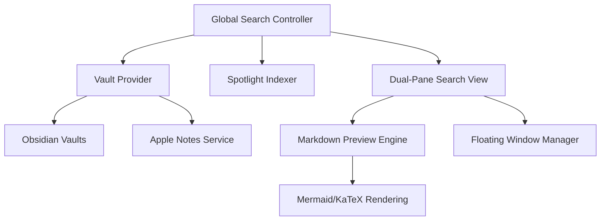
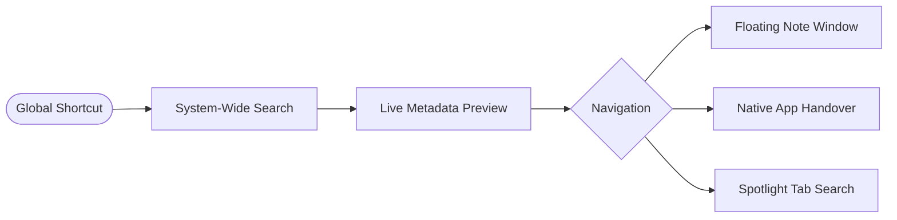

# NotesBar

NotesBar is a professional macOS utility designed to unify personal knowledge from Obsidian and Apple Notes into a single, high-performance interface. It provides system-wide search, instant previews, and seamless context preservation, enabling you to interact with your notes without disrupting your primary workflow.

## Architecture

The diagram below outlines the core components and data flow within the application.



## User Workflow

NotesBar streamlines the discovery and interaction of your notes through a unified search-first model.



## Core Features

- **Unified Search Interface**: A high-performance search experience that aggregates content from all Obsidian vaults and Apple Notes simultaneously.
- **Global Accessibility**: Access your entire knowledge base from any application using a dedicated system-wide shortcut (Ctrl + N).
- **Apple Notes Integration**: Native support for viewing and searching Apple Notes with high-fidelity Markdown previews.
- **Spotlight System Integration**: Deep integration with macOS Spotlight, including support for specialized "Tab to Search" functionality for rapid note retrieval.
- **Markdown and Diagram Rendering**: High-performance rendering of Markdown content, including complex Mermaid diagrams and KaTeX mathematical notation.
- **Persistent Floating Windows**: Ability to pin specific notes in independent, floating windows for continuous reference during complex tasks.
- **Context Preservation**: Designed to operate entirely from the menu bar and floating panels, ensuring your primary workspace remains undisturbed.

## Installation

### Requirements

- macOS 13.0 or later.
- Obsidian (Optional, for Obsidian vault support).

### Setup

1. **Download**: Obtain the latest distribution as a ZIP archive from the Releases page.
2. **Extraction**: Unpack the ZIP archive to your local storage.
3. **Deployment**: Move NotesBar.app to your Applications directory.
4. **Execution**: Launch the application and grant necessary permissions for directory access and Apple Notes retrieval.

## Development

### Prerequisites

- Xcode 15.0 or later.
- Swift 5.10+ toolchain.

### Build Process

1. Clone the repository:
   ```bash
   git clone https://github.com/aman-senpai/NotesBar.git
   ```
2. Open the project configuration:
   ```bash
   open NotesBar.xcodeproj
   ```
3. Compile and execute using Cmd+R within Xcode.

## Acknowledgments

- Obsidian ecosystem and URI schemes.
- Apple Notes framework and automation services.
- Mermaid.js for advanced diagramming logic.
- KaTeX for mathematical notation rendering.
