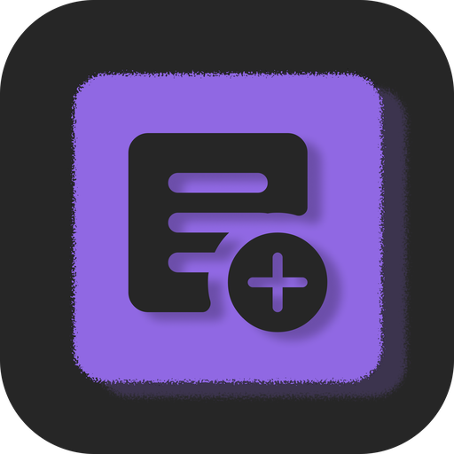
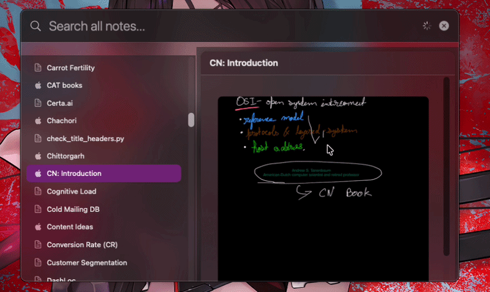
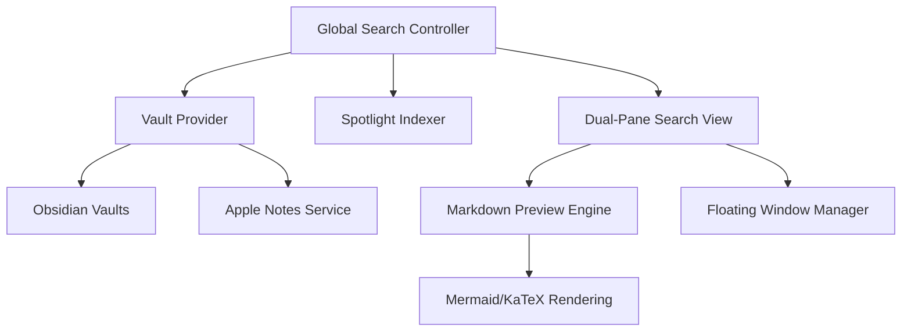

  
  <h1>NotesBar</h1>
  
<strong>A unified, professional macOS utility for Obsidian and Apple Notes.</strong>

NotesBar is a high-performance macOS utility designed to seamlessly unify your personal knowledge base across Obsidian and Apple Notes. It provides instantaneous system-wide search, live markdown previews, and floating context preservation, empowering you to interact with your notes without disrupting your primary workflow.

---

## 🏗 Architecture

The diagram below outlines the core components and data flow within the application.

---

## 🔄 User Workflow

NotesBar streamlines the discovery and interaction of your notes through a unified search-first model.

---

## ✨ Core Features

* **Unified Search Interface**
  A high-performance search experience that aggregates content from all Obsidian vaults and Apple Notes simultaneously.

* **Global Accessibility**
  Access your entire knowledge base from any application using a dedicated system-wide shortcut (`Ctrl + N`).

* **Apple Notes Integration**
  Native support for viewing and searching Apple Notes with high-fidelity Markdown previews.

* **Spotlight System Integration**
  Deep integration with macOS Spotlight, including support for specialized “Tab to Search” functionality for rapid note retrieval.

* **Markdown and Diagram Rendering**
  High-performance rendering of Markdown content, including complex Mermaid diagrams and KaTeX mathematical notation.

* **Persistent Floating Windows**
  Pin specific notes in independent, floating windows for continuous reference during complex tasks.

* **Context Preservation**
  Operates entirely from the menu bar and floating panels, ensuring your primary workspace remains undisturbed.

---

## 🙏 Acknowledgments

* Obsidian ecosystem and URI schemes
* Apple Notes framework and automation services
* Mermaid.js for diagram rendering
* KaTeX for mathematical notation support
