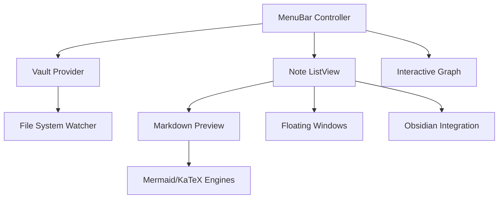
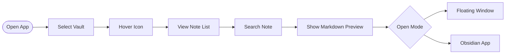

# NotesBar

NotesBar is a native macOS application that provides rapid access to your Obsidian vault directly from the menu bar. Designed for speed and minimal context switching, it allows users to search, preview, and visualize their knowledge base without full app transitions.

## Architecture

The diagram below outlines the core components and data flow within the application.



## User Workflow

NotesBar streamlines the navigation of your markdown notes through a concise interaction model.



## Features

- **Menu Bar Access**: Instant visibility and interaction from the macOS menu bar.
- **Vault Graph**: A force-directed graph to visualize note connections and clusters.
- **Markdown Rendering**: High-performance previews with syntax highlighting and task lists.
- **Mermaid Diagrams**: Native rendering of flowcharts, sequence diagrams, and gantt charts.
- **Mathematical Support**: Full KaTeX integration for high-quality mathematical notation.
- **Floating Windows**: Persist notes in independent windows for cross-task reference.
- **Deep Integration**: Seamlessly opens notes in Obsidian via URI schemes.

## Installation

### Requirements

- macOS 12.0 or later.
- Obsidian installed locally.

### Steps

1. **Download**: Obtain the latest distribution as a ZIP archive from the [Releases page](https://github.com/aman-senpai/NotesBar/releases).
2. **Extraction**: Unpack the ZIP archive to your local storage.
3. **Deployment**: Move `NotesBar.app` to your `/Applications` directory.
4. **Execution**: Launch the application and designate your primary Obsidian vault directory when prompted.

## Development

### Prerequisites

- Xcode 15.0 or later.
- Swift 5.9+ toolchain.

### Build Process

1. Clone the repository:
   ```bash
   git clone https://github.com/aman-senpai/NotesBar.git
   ```
2. Open the project configuration:
   ```bash
   open NotesBar.xcodeproj
   ```
3. Compile and execute using `Cmd+R` within Xcode.

## Contributions

Contributions are welcome via pull requests. Please ensure code quality and adhere to the existing design patterns.

## Acknowledgments

- [Obsidian](https://obsidian.md/) ecosystem.
- [Mermaid.js](https://mermaid-js.github.io/) for diagramming logic.
- [KaTeX](https://katex.org/) for mathematical rendering.
- [D3.js](https://d3js.org/) for graph visualization.
